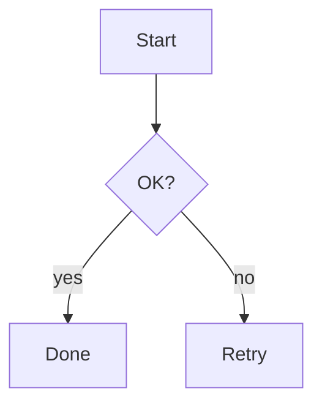
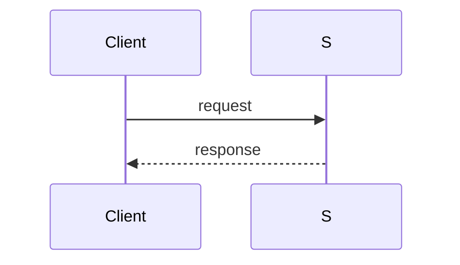

# MarkdownViewerPlugin Sample

플러그인 개발·QA용 예제 문서입니다. **굵게**, *이탤릭*, `인라인 코드`,
[링크](https://github.com/SosomLab/nexa-dir2),  를 포함합니다.

## 목록

- 항목 하나
  - 중첩 항목
- [x] 완료된 일
- [ ] 남은 일
1. 첫째
2. 둘째

## 표 (CJK 폭 정렬)

| 이름 | 값 | 비고 |
|:-----|---:|:----:|
| 한글 항목 | 42 | 가운데 |
| ascii | 7 | ok |

> 인용문 한 줄
>> 중첩 인용

---

```rust
fn main() {
    println!("code block");
}
```

## 다이어그램




